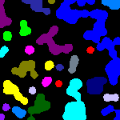

#### This project performs **Connected Component Labelling** (CCL) using openCV and numpy. The focus is on understanding the inner workings of image processing algorithms by handling:
- Pixel-level iteration
- Label assignment
- Equivalence resolution using ``set()`` and ``frozenset()`` operations

---

##  Features

- Two-pass labelling algorithm
- Uses ``set()`` and ``frozenset()`` to track equivalent labels
- Clean and simple logic flow
- Easy to extend for visualization or advanced analysis

---

##  How It Works

1. *First Pass*
   - Scan the binary image (2D list) row by row
   - Assign new labels or track equivalent labels using sets
   - Store equivalences in a set of frozensets

2. *Second Pass*

   - Flatten equivalence sets
   - Replace temporary labels with final unique ones

3. *Third Pass*
   - Assign different colors to components

## Demo
 &nbsp;&nbsp; 

&nbsp;&nbsp; input image &nbsp;&nbsp;&nbsp;&nbsp;&nbsp;&nbsp;&nbsp;&nbsp;&nbsp;&nbsp;&nbsp;&nbsp;&nbsp;&nbsp;&nbsp;&nbsp;&nbsp;&nbsp;&nbsp; output image

## How to run with frontend
- Install necessary libraries using pip

   `pip install -r requirements.txt`

- Go to app directory

   `cd app`

- Run the flask app

   `flask --app app.py run`

- For debugging run 
   
   `flask --app app.py run --debug`
